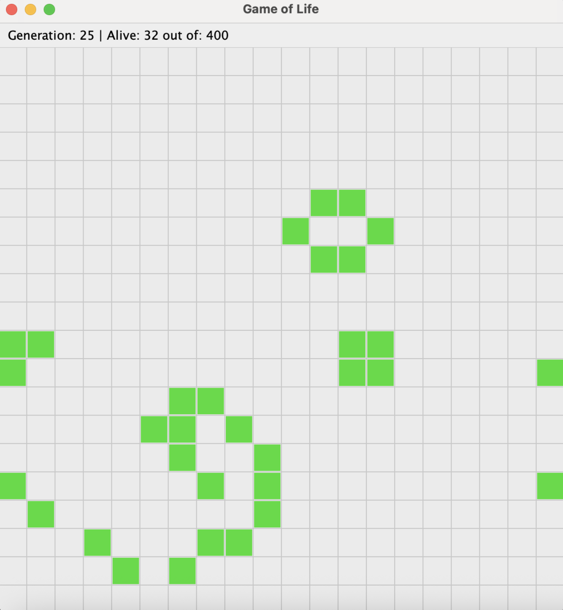

# Game of Life (Java + Swing)


An implementation of Conway's Game of Life in Java using Swing.  



---

## Features
- MVC separation between model, view, and controller
- Observer pattern (`LifeListener`, `LifeChangeEvent`) for model updates
- Toroidal grid (edges wrap around)
- JUnit 5 unit tests for rules and common patterns (blinker, glider, still lifes)
- Swing UI with grid rendering, live cell highlighting, and status bar
- Randomized initialization of live cells

---

## Download
Pre-built JARs are available under [Releases](https://github.com/robertciotoiu/game-of-life/releases).

Example:
```bash
java -jar game-of-life-1.0-SNAPSHOT.jar
```

---

## Running the project

### Requirements
- Java 21 (LTS)
- Maven 3.9+

### Run with Maven
```bash
mvn clean compile exec:java -Dexec.mainClass="com.robertciotoiu.GameOfLifeApp"
```

### Build a JAR
```bash
mvn clean package
java -jar target/game-of-life-1.0-SNAPSHOT.jar
```

### Running Tests
```bash
mvn test
```

**Unit tests**
  - Birth, death, and survival rules
  - Edge wrapping behavior

**Integration tests**
  - Still life: block
  - Oscillator: blinker
  - Spaceship: glider
